# Informe Final

## Título del proyecto

**Proyecto de monitoreo de sensores IoT mediante Zabbix para gestión de redes**

---

## Nombre(s) autor(es)

- Esneider Segovia Casarrubia
- Yesid Mahecha Valero

---

## Profesor

**Nombre Docente Ing.:** Jaider Ospina Navas

---

## Institución

**Universidad Militar Nueva Granada - UMNG**  
**Facultad de Ingeniería**  
**Tecnología en Telecomunicaciones**  
**Fecha:** 18 de nov. de 2025

---

## Tabla de contenido

- [Resumen](#resumen)
- [Palabras clave](#palabras-clave)
- [Introducción](#introducción)
- [Objetivos](#objetivos)
- [Marco teórico](#marco-teórico)
- [Metodología](#metodología)
- [Resultados y discusión](#resultados-y-discusión)
- [Conclusiones](#conclusiones)
- [Recomendaciones para futuras implementaciones](#recomendaciones-para-futuras-implementaciones)
- [Referencias](#referencias)
- [Anexos](#anexos)

---

## Resumen

El presente informe documenta el desarrollo y la implementación parcial de un proyecto enfocado en la monitorización remota de variables ambientales (temperatura y humedad) utilizando un microcontrolador Arduino como plataforma de adquisición de datos y el sistema de monitoreo Zabbix para la gestión de red. El objetivo era establecer un sistema integral que permitiera visualizar datos de sensores en tiempo real y configurar alertas. La metodología incluyó la preparación de una máquina virtual (VMware) con el servidor Zabbix y la configuración de las conexiones de red necesarias para la comunicación con el dispositivo físico (Arduino UNO con Shield Ethernet). Aunque se logró exitosamente la conectividad de red entre la VM y la máquina física, la implementación final del monitoreo no pudo completarse. Los principales obstáculos identificados fueron la limitación en la documentación de referencia —la cual solo presentaba resultados finales sin pasos detallados de configuración— y el fallo persistente en la conexión del Agente Zabbix entre el Arduino y el servidor. Este informe detalla el proceso, los esfuerzos realizados para aislar la falla de conexión y las limitaciones encontradas, concluyendo con los aprendizajes adquiridos y recomendaciones para futuras iteraciones del proyecto.

---

## Palabras clave

Zabbix, Monitoreo de Sensores, Gestión de Red, VMware, Virtualización, Arduino, IoT.

---

## Introducción

La gestión proactiva de redes y la infraestructura de Internet de las Cosas (IoT) requieren herramientas de monitoreo robustas y escalables. Zabbix se posiciona como una solución de código abierto idónea para este propósito. El proyecto tuvo como finalidad aplicar los conocimientos de la asignatura de Gestión de Redes para integrar un sistema físico de sensores (Arduino UNO con Shield Ethernet) con un sistema de monitoreo de nivel empresarial (Zabbix). Este ejercicio práctico buscaba cimentar las habilidades en la configuración de hosts, ítems y triggers dentro de un entorno de virtualización, así como la resolución de problemas de conectividad inter-sistema. A pesar de los esfuerzos y de seguir las guías disponibles, el proyecto se enfrentó a barreras técnicas y de documentación que impidieron alcanzar la etapa de visualización de datos en Zabbix, lo cual se aborda detalladamente en las secciones subsiguientes.

---

## Objetivos

### Objetivo general

Diseñar, configurar e intentar implementar un sistema integral de monitoreo remoto de variables ambientales (temperatura y humedad) utilizando la plataforma Arduino como fuente de datos y Zabbix como sistema centralizado de gestión y visualización de red.

### Objetivos específicos

1. Configurar un entorno de virtualización (VMware) para la instalación y operación del servidor Zabbix.
2. Establecer y verificar la conectividad de red bidireccional entre la máquina virtual que aloja Zabbix y la máquina física/dispositivo Arduino.
3. Implementar la lógica de adquisición de datos en el microcontrolador Arduino y adaptarla para la comunicación con el Agente Zabbix.
4. Identificar y documentar los obstáculos técnicos y metodológicos que impidan la correcta integración y monitorización en Zabbix.

---

## Marco teórico

- **Arduino UNO con Shield Ethernet:** Plataforma de microcontrolador utilizada para el proyecto. El Arduino UNO lee datos de los sensores (e.g., DHT11 para T/H) y, mediante el Shield Ethernet (basado en el chip W5100 o similar), establece la conectividad física a la red, permitiéndole actuar como un host que envía información al servidor Zabbix.
- **Zabbix:** Sistema de monitoreo distribuido que utiliza agentes (o protocolos como SNMP, trappers) para recibir datos de los hosts. En este proyecto se pretendía usar una implementación del Agente Zabbix para Arduino (referenciado en la documentación como Arduino-Zabbix-Agent), que permite al microcontrolador enviar datos directamente a la plataforma de manera activa.
- **Virtualización (VMware):** Se utilizó para hospedar el Servidor Zabbix, simulando un entorno de servidor dedicado y facilitando la gestión y aislamiento del sistema operativo para el monitoreo.
- **Conectividad de red:** La comunicación entre la VM (Servidor Zabbix) y la red física (Arduino) es crítica y debe asegurar que los paquetes de datos del Agente lleguen al Zabbix Server Trapper o al Zabbix Proxy.

---

## Metodología

### 1. Preparación del entorno

- **Instalación de Zabbix Server:** Se instaló una distribución Linux en VMware (máquina virtual) y se procedió a la instalación del Zabbix Server y su base de datos (PostgreSQL/MySQL), siguiendo la documentación oficial.
- **Preparación de Arduino:** Se utilizó el microcontrolador Arduino UNO sobre el cual se montó el Shield Ethernet para proveer la interfaz de red cableada. Se ensambló el circuito con el sensor DHT11. Se configuró el IDE de Arduino y se cargó el firmware del Agente Zabbix adaptado para el sensor de temperatura y humedad, incluyendo las credenciales IP del servidor.

### 2. Configuración de conectividad

- **Configuración de Red en VMware:** Se configuró el adaptador de red de la máquina virtual en modo puente (Bridge Mode) para asegurar que compartiera el mismo segmento de red con la máquina física y el dispositivo Arduino.
- **Pruebas de Conectividad:** Se realizaron pruebas ping exitosas desde la máquina virtual hacia la máquina física y viceversa, confirmando la visibilidad a nivel de capa 3 (IP) y la correcta configuración de las reglas de firewall para el tráfico de Zabbix (puerto 10051).

### 3. Configuración de monitoreo (fase parcial)

- **Configuración de Host en Zabbix:** Se creó el Host para el Arduino en la interfaz web de Zabbix, especificando la IP asignada al dispositivo y configurándolo como un Zabbix Agent (active).
- **Configuración de Ítems:** Se definieron los ítems (items) con las claves (keys) correspondientes (temperature, humidity) que el firmware del Arduino debía enviar.

---

## Resultados y discusión

- **Limitación por documentación incompleta:** Se consultaron múltiples fuentes, incluyendo las referencias proporcionadas, que presentaron principalmente código fuente o imágenes del sistema funcionando. Faltaron pasos críticos de troubleshooting y configuración detallada del firmware del Arduino y del Host en Zabbix, obligando a suposiciones sobre parámetros y claves.
- **Éxito en la conexión de red:** Se confirmó la total operatividad de la red a nivel de transporte y red. Las pruebas de ping fueron consistentes y exitosas. Se validó el Bridge Mode en VMware y la ausencia de bloqueos de firewall para comunicación básica.
- **Fallo específico en la conexión Zabbix:** El Zabbix Server no recibió datos del Arduino Agent (puerto 10051). El Host quedó en estado “Unknown” o “Not available”. El sniffing mostró comunicación IP, pero no el intercambio correcto del protocolo Zabbix. Posibles causas:
  - **Incompatibilidad de protocolo:** Firmware del Arduino Agent desactualizado o incompatible con la versión del Zabbix Server.
  - **Claves de ítems incorrectas:** Diferencias entre la clave configurada y la cadena enviada por Arduino.
  - **Errores de compilación/librerías:** Fallas silenciosas en la adaptación del código del agente a librerías del DHT11.

---

## Conclusiones

El proyecto de monitoreo de sensores con Zabbix y Arduino constituyó un ejercicio valioso para la resolución de problemas y la gestión de red. Se demostró la capacidad para configurar entornos virtualizados y conexiones de red inter-sistema con Arduino UNO y Shield Ethernet, superando retos iniciales a nivel de red. La integración completa falló principalmente por la falta de documentación detallada y problemática en el agente Zabbix para Arduino. Pese a no lograr datos en tiempo real, se establecieron bases teóricas y prácticas: instalación del servidor, configuración de red y definición de Hosts e Ítems en Zabbix.

---

## Recomendaciones para futuras implementaciones

- **Protocolos estándar:** Migrar a MQTT o HTTP para el envío de datos desde dispositivos IoT hacia Zabbix (vía scripts, webhooks o intermedios).
- **Compatibilidad de versiones:** Validar versiones exactas entre Zabbix Server y el agente/firmware elegido.
- **Investigación comunitaria:** Invertir tiempo en guías de troubleshooting específicas de la comunidad y foros técnicos, más allá de la documentación inicial.

---

## Referencias

- Jhonatan Lamina. (s.f.). Temperatura y Humedad con Arduino y Zabbix. https://jhonatanlamina.com/temperatura-y-humedad-con-arduino-y-zabbix/
- Zabbix. (s.f.). Integraciones Arduino. https://www.zabbix.com/la/integrations/arduino
- interlegis. (s.f.). Arduino-Zabbix-Agent (GitHub). https://github.com/interlegis/Arduino-Zabbix-Agent
- Documentación Oficial de Arduino. https://www.arduino.cc/
- Documentación Oficial de Zabbix. https://www.zabbix.com/

---

## Anexos

### Anexo A: Diagrama de conexión de sensores

Obtenido de: https://github.com/interlegis/Arduino-Zabbix-Agent?tab=readme-ov-file#materials

### Anexo B: Capturas de configuración de red en VMware (Bridge)

  
  

### Anexo C: Estado del Host en Zabbix

  
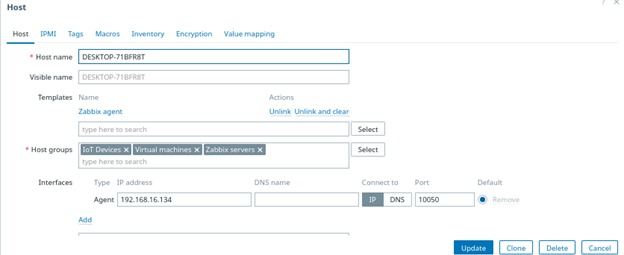

### Anexo Ítems

  
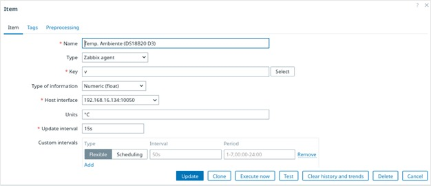
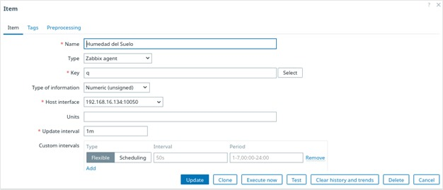
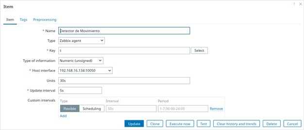

### Anexo Trigger

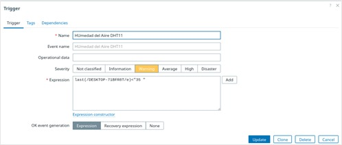
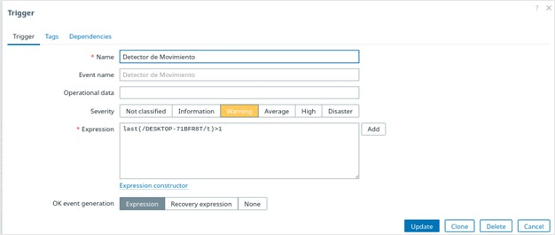
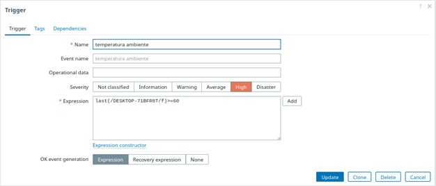
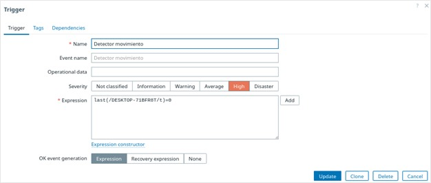

### Anexo creación Dashboard

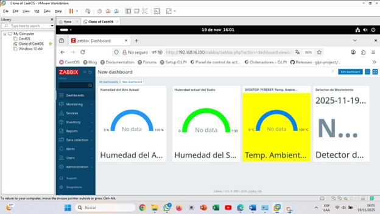
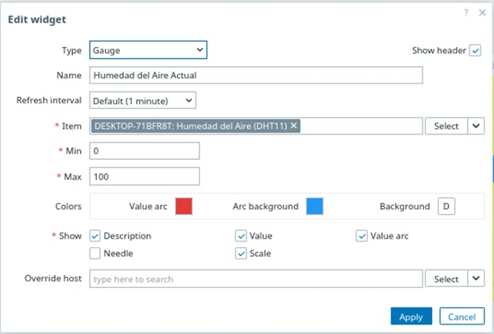
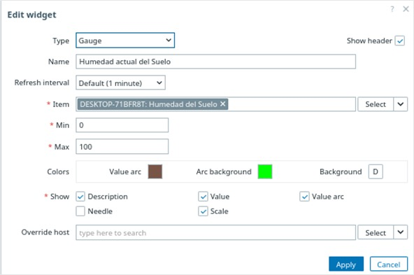
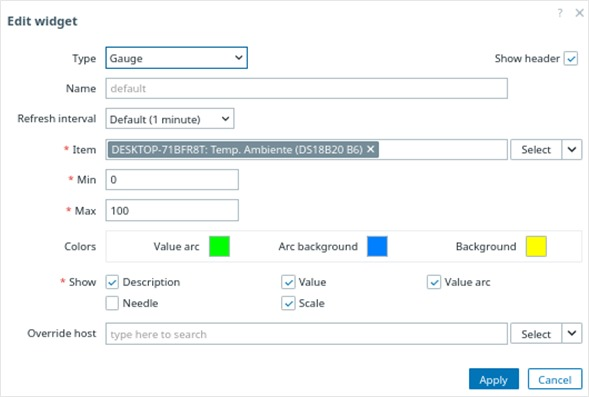

### Conexiones Fisicas
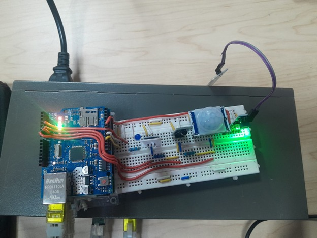

 
 

 
 

 
         
