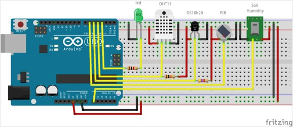

# proyecto-de-monitoreo-de-sensores-IoT-mediante-zabbix-para-gesti-n-de-redes
estudiante
Informe Final
Título del Proyecto
proyecto de monitoreo de sensores IoT mediante zabbix para gestión de redes

Nombre(es) Autor(es)
Esneider Segovia Casarrubia
Yesid Mahecha Valero

Profesor:
Nombre Docente Ing:
Jaider Ospina Navas

Universidad Militar Nueva Granada - UMNG
Facultad de Ingeniería
Tecnología en Telecomunicaciones
18 de nov. de 2025

Tabla de Contenido
Resumen (Abstract)	.
Palabras Clave	.
Introduccion	.
Objetivos	.
Marco Teorico	.
Metodologia	.
Resultados o Discusión	.
Conclusiones	.
Referencias	.
Anexos	.

	

Resumen
El presente informe documenta el desarrollo y la implementación parcial de un proyecto enfocado en la monitorización remota de variables ambientales (temperatura y humedad) utilizando un microcontrolador Arduino como plataforma de adquisición de datos y el sistema de monitoreo Zabbix para la gestión de red. El objetivo era establecer un sistema integral que permitiera visualizar datos de sensores en tiempo real y configurar alertas. La metodología incluyó la preparación de una máquina virtual (VMware) con el servidor Zabbix y la configuración de las conexiones de red necesarias para la comunicación con el dispositivo físico (Arduino UNO con Shield Ethernet). Aunque se logró exitosamente la conectividad de red entre la VM y la máquina física, la implementación final del monitoreo no pudo completarse. Los principales obstáculos identificados fueron la limitación en la documentación de referencia —la cual solo presentaba resultados finales sin pasos detallados de configuración— y el fallo persistente en la conexión del Agente Zabbix entre el Arduino y el servidor. Este informe detalla el proceso, los esfuerzos realizados para aislar la falla de conexión y las limitaciones encontradas, concluyendo con los aprendizajes adquiridos y recomendaciones para futuras iteraciones del proyecto.
Palabras clave: Zabbix, Monitoreo de Sensores, Gestión de Red, VMware, Virtualización, Arduino, IoT.

Introducción
La gestión proactiva de redes y la infraestructura de Internet de las Cosas (IoT) requieren herramientas de monitoreo robustas y escalables. Zabbix se posiciona como una solución de código abierto idónea para este propósito. El proyecto tuvo como finalidad aplicar los conocimientos de la asignatura de Gestión de Redes para integrar un sistema físico de sensores (Arduino UNO con Shield Ethernet) con un sistema de monitoreo de nivel empresarial (Zabbix). Este ejercicio práctico buscaba cimentar las habilidades en la configuración de hosts, ítems y triggers dentro de un entorno de virtualización, así como la resolución de problemas de conectividad inter-sistema. A pesar de los esfuerzos y de seguir las guías disponibles, el proyecto se enfrentó a barreras técnicas y de documentación que impidieron alcanzar la etapa de visualización de datos en Zabbix, lo cual se aborda detalladamente en las secciones subsiguientes.

Objetivos
Objetivo General
Diseñar, configurar e intentar implementar un sistema integral de monitoreo remoto de variables ambientales (temperatura y humedad) utilizando la plataforma Arduino como fuente de datos y Zabbix como sistema centralizado de gestión y visualización de red.
Objetivos Específicos
1.	Configurar un entorno de virtualización (VMware) para la instalación y operación del servidor Zabbix.
2.	Establecer y verificar la conectividad de red bidireccional entre la máquina virtual que aloja Zabbix y la máquina física/dispositivo Arduino.
3.	Implementar la lógica de adquisición de datos en el microcontrolador Arduino y adaptarla para la comunicación con el Agente Zabbix.
4.	Identificar y documentar los obstáculos técnicos y metodológicos que impidan la correcta integración y monitorización en Zabbix.

Marco teórico
El monitoreo de red se fundamenta en la recopilación constante de métricas para asegurar la disponibilidad y rendimiento de los componentes. En el contexto de IoT, esto se extiende a dispositivos con sensores, como el Arduino. El modelo propuesto utiliza:
•	Arduino UNO con Shield Ethernet: Plataforma de microcontrolador utilizada para el proyecto. El Arduino UNO lee datos de los sensores (e.g., DHT11 para T/H) y, mediante el Shield Ethernet (basado en el chip W5100 o similar), establece la conectividad física a la red, permitiéndole actuar como un host que envía información al servidor Zabbix.
•	Zabbix: Sistema de monitoreo distribuido que utiliza agentes (o protocolos como SNMP, trappers) para recibir datos de los hosts. En este proyecto se pretendía usar una implementación del Agente Zabbix para Arduino (referenciado en la documentación como Arduino-Zabbix-Agent), que permite al microcontrolador enviar datos directamente a la plataforma de manera activa.
•	Virtualización (VMware): Se utilizó para hospedar el Servidor Zabbix, simulando un entorno de servidor dedicado y facilitando la gestión y aislamiento del sistema operativo para el monitoreo.
•	Conectividad de Red: La comunicación entre la VM (Servidor Zabbix) y la red física (Arduino) es crítica y debe asegurar que los paquetes de datos del Agente lleguen al Zabbix Server Trapper o al Zabbix Proxy.

Metodología
La metodología se estructuró en tres fases principales: Preparación del Entorno, Configuración de Conectividad y Configuración de Monitoreo.
1.	Preparación del Entorno
o	Instalación de Zabbix Server: Se instaló una distribución Linux en VMware (máquina virtual) y se procedió a la instalación del Zabbix Server y su base de datos (PostgreSQL/MySQL), siguiendo la documentación oficial.
o	Preparación de Arduino: Se utilizó el microcontrolador Arduino UNO sobre el cual se montó el Shield Ethernet para proveer la interfaz de red cableada. Se ensambló el circuito (similar a la ) con el sensor DHT11. Se configuró el IDE de Arduino y se cargó el firmware del Agente Zabbix adaptado para el sensor de temperatura y humedad, incluyendo las credenciales IP del servidor.
2. Configuración de Conectividad
o	Configuración de Red en VMware: Se configuró el adaptador de red de la máquina virtual en modo puente (Bridge Mode) para asegurar que compartiera el mismo segmento de red con la máquina física y el dispositivo Arduino.
o	Pruebas de Conectividad: Se realizaron pruebas ping exitosas desde la máquina virtual hacia la máquina física y viceversa, confirmando la visibilidad a nivel de capa 3 (IP) y la correcta configuración de las reglas de firewall para el tráfico de Zabbix (puerto 10051).
3.	Configuración de Monitoreo (Fase Parcial)
o	Configuración de Host en Zabbix: Se creó el Host para el Arduino en la interfaz web de Zabbix, especificando la IP asignada al dispositivo y configurándolo como un Zabbix Agent (active).
o	Configuración de Ítems: Se definieron los ítems (items) con las claves (keys) correspondientes (temperature, humidity) que el firmware del Arduino debía enviar.

Resultados y discusión
El proyecto logró completar las fases de preparación y conectividad, pero fracasó en la fase de monitoreo, generando los siguientes resultados a discutir:
1.	Limitación por Documentación Incompleta
Se consultaron múltiples fuentes, incluyendo las referencias proporcionadas (e.g., https://github.com/interlegis/Arduino-Zabbix-Agent), las cuales presentaron principalmente el código fuente o la imagen final del sistema funcionando. La documentación era incompleta en lo que respecta a los pasos críticos de troubleshooting y configuración detallada del firmware del Arduino junto con la configuración específica del Host en el Zabbix Server. No se encontraron guías detalladas paso a paso que cubrieran la totalidad del proceso de integración, lo que obligó a realizar suposiciones sobre los parámetros y claves, consumiendo tiempo valioso en la etapa de depuración.
2.	Éxito en la Conexión de Red
Se confirmó la total operatividad de la red a nivel de capa de transporte y red. Las pruebas de ping desde la VM (Zabbix Server) a la máquina física y viceversa fueron consistentes y exitosas. Esto demostró la correcta configuración del Bridge Mode en VMware y la inexistencia de problemas de firewall que impidieran la comunicación básica.
3.	Fallo Específico en la Conexión Zabbix
El fallo crítico se localizó en la incapacidad del Zabbix Server de recibir datos del Arduino Agent (puerto 10051). A pesar de que el código del Arduino indicaba el envío activo de datos, el Host en Zabbix se mantuvo en estado "Unknown" o "Not available". Las pruebas de captura de paquetes (sniffing) mostraron la comunicación a nivel de IP, pero no se pudo confirmar el correcto intercambio de los paquetes de protocolo Zabbix. Las posibles causas de esta falla son:
o	Incompatibilidad de Protocolo: Versión desactualizada o incompatibilidad del firmware del Arduino Agent con la versión instalada del Zabbix Server.
o	Claves de Ítems Incorrectas: Una discrepancia sutil entre la clave de item configurada en Zabbix y la cadena de texto enviada por el Arduino.
o	Error de Compilación/Librería: Fallas silenciosas en la adaptación del código base del Arduino Agent a las librerías específicas del sensor DHT11.
4.	Implicaciones de los Obstáculos
La imposibilidad de obtener datos en Zabbix impidió alcanzar el objetivo final de la asignatura: la creación de gráficos, dashboards y triggers. El obstáculo principal no fue la falta de esfuerzo o la inexperiencia con Zabbix, sino la brecha en la documentación de implementación detallada para este caso de uso tan específico.

Conclusiones
El proyecto de monitoreo de sensores con Zabbix y Arduino constituyó un ejercicio invaluable para la resolución de problemas y la gestión de red. En primer lugar, se demostró una capacidad efectiva para configurar entornos virtualizados y establecer complejas conexiones de red inter-sistema utilizando el Arduino UNO y el Shield Ethernet, logrando superar los desafíos iniciales a nivel de la capa de red entre la máquina virtual y el equipo físico. A pesar de este éxito en la conectividad, la integración completa fue fallida. Esto se debió principalmente a una limitación crítica en las fuentes de información: se confirma que la disponibilidad de documentación detallada y probada es tan crucial como la propia configuración técnica. La dependencia de código fuente sin guías claras de debugging para la configuración del Agente Zabbix en el microcontrolador fue el factor limitante principal. No obstante, aunque el objetivo de obtener datos en tiempo real no se alcanzó, se establecieron con éxito las bases teóricas y prácticas, incluyendo la instalación del servidor, la configuración de red y la definición de Hosts e Items en Zabbix.

Recomendaciones para Futuras Implementaciones
Dada la naturaleza específica de los obstáculos encontrados, se recomienda para futuras iteraciones del proyecto considerar alternativas que mejoren la robustez y la documentación de la integración IoT. Esto incluye la transición hacia protocolos más estándar y mejor soportados para la comunicación de datos, como MQTT o el envío de datos mediante HTTP requests, en lugar de depender del Agente Zabbix directo en el microcontrolador. Asimismo, es fundamental validar la compatibilidad exacta entre las versiones del Zabbix Server y cualquier agente o firmware de código abierto utilizado, y asignar tiempo adicional para una investigación profunda en búsqueda de guías de troubleshooting específicas de la comunidad de usuarios, más allá de la documentación inicial del proyecto.
Referencias 
Jhonatan Lamina. (s.f.). Temperatura y Humedad con Arduino y Zabbix. Recuperado de: https://jhonatanlamina.com/temperatura-y-humedad-con-arduino-y-zabbix/
Zabbix. (s.f.). Integraciones Arduino. Recuperado de: https://www.zabbix.com/la/integrations/arduino
interlegis. (s.f.). Arduino-Zabbix-Agent. Repositorio de GitHub. Recuperado de: https://github.com/interlegis/Arduino-Zabbix-Agent
Documentación Oficial de Arduino. Recuperado de: https://www.arduino.cc/
Documentación Oficial de Zabbix. Recuperado de: https://www.zabbix.com/

Anexos Opcionales
Anexo A: Diagrama de Conexión de Sensores

 Obtenido de: https://github.com/interlegis/Arduino-Zabbix-Agent?tab=readme-ov-file#materials

Anexo B: Captura de Pantalla - Configuración de Red VMware (Muestra la configuración del adaptador de red en modo Puente)
 
 

 

      Anexo C: Captura de Pantalla - Estado del Host en Zabbix (Muestra el Host "Arduino-Sensor" en estado "Unknown" o "Not available")
 
 
      Anexo ítems:

 

 
 
 
Anexo Trigger:
 

 
 
 
Anexo creación Dashboard
 
 
 
 

 
 

 
         
